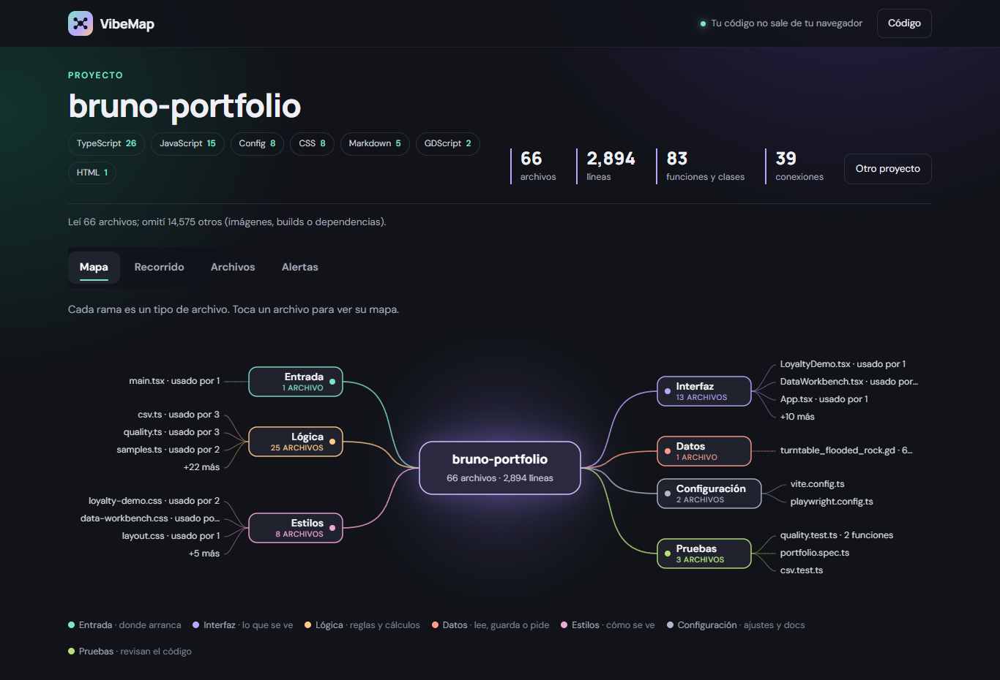

# VibeMap

[](https://github.com/Brunich/VibeMap/actions/workflows/ci.yml)

**Suelta la carpeta de un proyecto y míralo como mapa mental:** dónde arranca, qué archivo usa a cuál, qué funciones define cada uno y qué está sobrando.

**En vivo: https://vibemap-brunich.vercel.app**



Nació en un hackathon (equipo de 3, 8 horas) para entender el código que te genera una IA. Esta es mi versión: la tomé del [repositorio del equipo](https://github.com/CharlsMex24/VibeMap_Hackathon) con su historial y la rehíce para que funcione sin servidor ni clave de API.

## Qué ves

| Vista | Qué te dice |
|---|---|
| **Mapa** | El proyecto al centro y una rama por tipo de archivo: entrada, interfaz, lógica, datos, estilos, configuración y pruebas. Cada hoja es un archivo con cuántos lo usan. |
| **Recorrido** | Lo que se carga, en orden, desde la entrada: qué archivo carga a cuál y para usar qué. |
| **Archivos** | El mapa de cada archivo (quién lo usa a la izquierda, qué usa a la derecha), sus funciones con quién las llama y a quién llaman, y el código con esas líneas marcadas. |
| **Alertas** | Imports en círculo, archivos que nadie usa, archivos de más de 400 líneas y funciones exportadas que nadie llama. |

Entiende **TypeScript, JavaScript/React, Python y GDScript (Godot)**. Para probarlo sin subir nada trae dos ejemplos: su propio código y un RPG chico en Godot.

## Cómo funciona

Todo pasa en el navegador ([`client/src/analyze.ts`](client/src/analyze.ts)); tu código no sale de tu equipo.

1. **Lee.** Recorre la carpeta, ignora `node_modules`, builds, binarios y archivos generados, y quita comentarios.
2. **Encuentra.** Imports de cada lenguaje (`import`/`require`, `from … import`, `preload`/`load` y las clases globales `class_name` y autoloads de Godot) y las funciones, clases y componentes que define cada archivo.
3. **Resuelve.** Convierte cada import en un archivo real del proyecto (extensiones, `index`, imports `.js` que apuntan a `.ts`, rutas `res://`) o en un paquete externo.
4. **Conecta.** Busca en el cuerpo de cada función las llamadas a funciones del mismo archivo o de los archivos que importa.
5. **Interpreta.** Detecta la entrada (`createRoot`, `app.listen`, `if __name__ == "__main__"`, la escena principal de `project.godot`), clasifica cada archivo por su ruta y lo que hace, y arma el recorrido y las alertas.

El mapa mental es SVG dibujado a mano ([`MindMap.tsx`](client/src/MindMap.tsx)); en el celular se vuelve un árbol.

### Explicar con IA (opcional)

El servidor original del hackathon sigue en [`src/`](src/): con una clave de Gemini, el botón **Explicar con IA** de cada archivo le pide una explicación paso a paso.

```bash
cp .env.example .env         # pon tu GEMINI_API_KEY
npm install && npm run server
cd client && VITE_AI=on npm run dev
```

## Correr y probar

```bash
cd client
npm install
npm run dev     # http://localhost:5173
npm test        # pruebas del analizador (node:test)
```

## Qué sigue

- Llamadas a métodos a través de objetos (`player.inventory.add_item`) con el tipo de la variable.
- Más lenguajes: C# (Unity) y Go.
- Exportar el mapa como imagen.

## Créditos

Idea y primera versión: el equipo del hackathon, en [CharlsMex24/VibeMap_Hackathon](https://github.com/CharlsMex24/VibeMap_Hackathon). Su historial viene completo en este repositorio.
